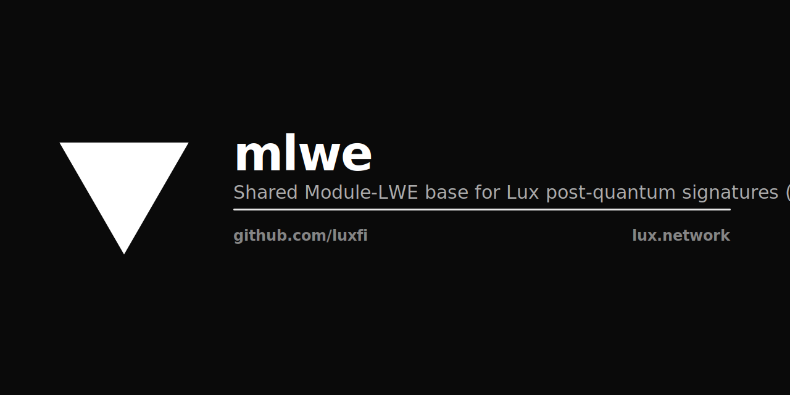

<p align="center"></p>

# mlwe — shared Module-LWE base for Lux post-quantum signatures

`github.com/luxfi/mlwe` is the common cryptographic substrate beneath the
Lux post-quantum signature schemes. Pulsar (FIPS 204 / ML-DSA, the 23-bit
ring `q = 8 380 417`) and Corona (Ringtail/Raccoon, the 48-bit ring
`q = 0x1000000004A01`) are **both Module-LWE** constructions over
`R_q = Z_q[X]/(X^256 + 1)`. They independently re-implemented the same
ring arithmetic, SHAKE samplers, Shamir/Lagrange sharing, SP 800-185
transcript hashing, and bit-packing codecs. This module factors that
common surface out exactly once.

## Phase 0 — pure-stdlib core

Phase 0 depends only on `golang.org/x/crypto/sha3`. No Lattigo, no CGO:
the EVM precompile import path never pulls a heavy dependency.

| Package | Concern |
|---|---|
| `mlwe` | Value types (`Poly`, `PolyVec`, `PolyMat`, `Profile`) and small interfaces (`Ring`, `RoundingRing`, `Codec`). No internal deps. |
| `ring/mldsa` | The concrete FIPS 204 23-bit ring, arithmetic lifted **verbatim** from the audited Pulsar reference. Byte-identical FIPS 204 output. |
| `sample/shake` | FIPS 204 SHAKE samplers: `ExpandA`, `ExpandS` (centered binomial), `ExpandMask`, `SampleInBall`. |
| `share` | Generic Shamir sharing + Lagrange over a `Field` interface (`GF(p)`, with `MLDSAField` = `GF(8380417)`). |
| `transcript` | SP 800-185 `CShake256`, `KMAC256`, `TupleHash256` and the §2.3 encoders — the one hashing copy. |
| `codec` | LSB-first `PackBits`/`UnpackBits` and a length-capped `ReadVector[T]` that hard-bounds framed lengths (recursion/allocation-bomb guard). |
| `modulesis` | Ring-generic Module-SIS toolkit: `MatVec`, `InfNorm`, `L2Sq`, and the vector liftings of the rounding primitives. |
| `zeroize` | One best-effort secret-wipe helper. |

Deferred to Phase 2 (require Lattigo): `ring/lattigo`, `sample/gaussian`.

## Design

Small interfaces, values not places, no compound-word names. A `Ring`
exposes the irreducible per-polynomial primitives; everything that acts
on module vectors or matrices composes them in `modulesis`, so it works
unchanged for the 23-bit and 48-bit rings. Concerns are separated one to
a package: arithmetic, sampling, sharing, hashing, packing, norms,
wiping.

### NTT convention

The `ring/mldsa` core preserves the verbatim constant-time Montgomery
arithmetic (R = 2^32). The contract a caller relies on is the
**multiplication round-trip**:

```
INTT(MulNTT(NTT(a), NTT(b))) == a * b   in R_q
```

The bare round-trip `INTT(NTT(p))` equals `R*p mod q`, not `p`: the
inverse transform's `R` factor is what cancels the Montgomery product's
`R^-1`. This is intrinsic to a constant-time Montgomery ring and is
covered explicitly by the tests.

## License

Apache 2.0. See [LICENSE](LICENSE).
